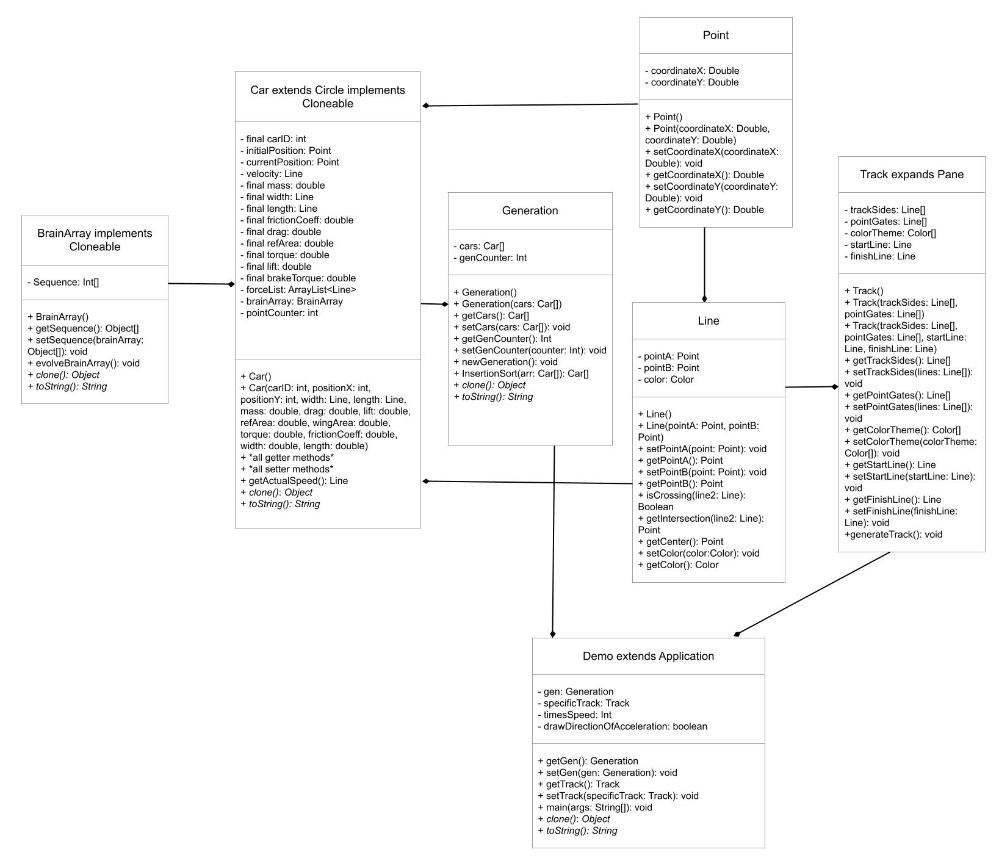

# Evolution-and-generation-algorithms-for-virtual-self-driving-cars
This project was used as a final project of computer science studies. The whole project is coded in Java and JavaFX. 

The point of this whole project is to create an algorithm that will be able to find the fastest paths for race car with somewhat accurate physics in two dimensions.

Because of covid circumstances, one out of three programmers in our project left before the end of the semester. This programmer was in charge of the track panes. Our presentation had to, thus, be presented with a incomplete demo.

However, recently I have started to update my Github profile, and I am currently working on a working demo for this project to showcase to any recruiter who needs experience in object oriented programming.

---

Through this class, we also had to create a UML diagram. Our project's plan was to incorporate this following design into code.

I am hoping to be able to incorporate this design into my demo of this project.
